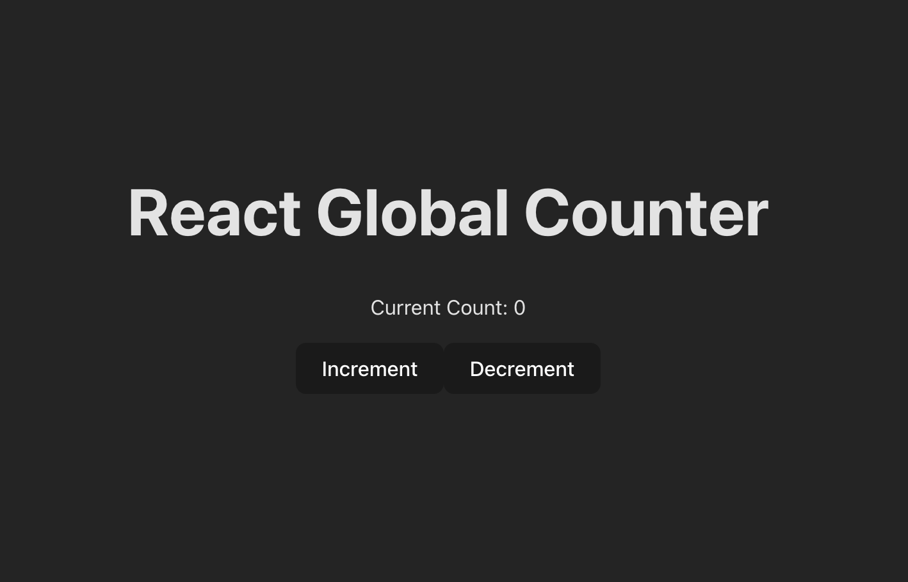
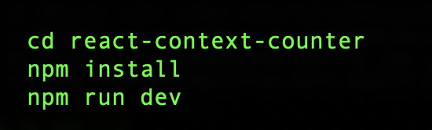

<p align="center">
  
</p>

# React State Management with Context

## Objective
Build a counter app using React Context API to manage global state.

## Why This Matters
Passing props through deeply nested components can be painful. This exercise shows how to eliminate that using [React Context](https://react.dev/reference/react/useContext).

## Concepts You’ll Learn
- [React Context API](https://react.dev/reference/react/hooks#context-hooks)
- [createContext()](https://react.dev/reference/react/createContext)
- [Context.Provider](https://react.dev/reference/react/createContext#provider)
- [useContext()](https://react.dev/reference/react/useContext)


## Get started
<p align="center">
  
</p>

## Deliverables
- Global state using `CounterContext`
- Counter display component
- Buttons to increment and decrement
- Good React architecture practices

## Bonus
- Add a reset button
- Add a second counter display elsewhere
- Add a log of previous changes

## File Structure
```
/src
  /components
    CounterControls.js
    CounterDisplay.js
  /context
    CounterContext.js
  App.js
  index.js
```

## Reflection Questions (in reflection.md)
1. Why is context useful?
2. How is it different from local state?
3. What would prop drilling look like here?
